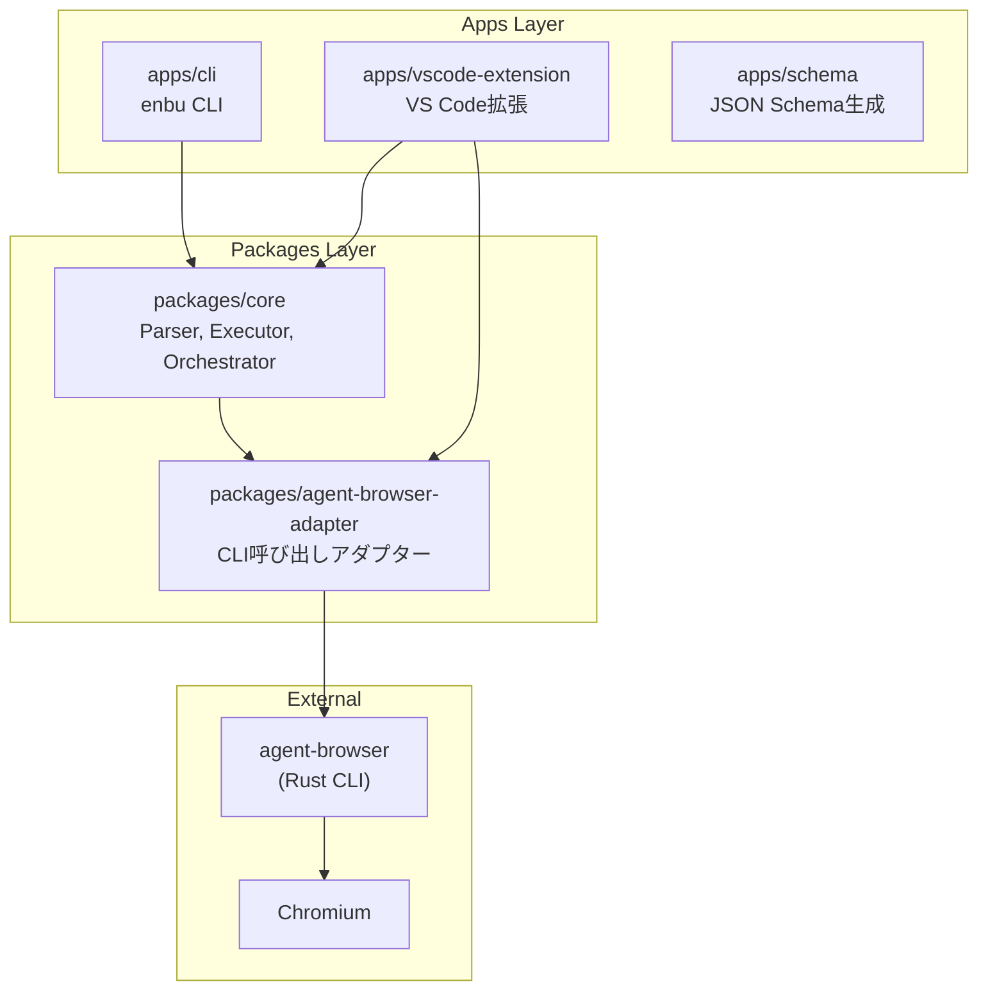
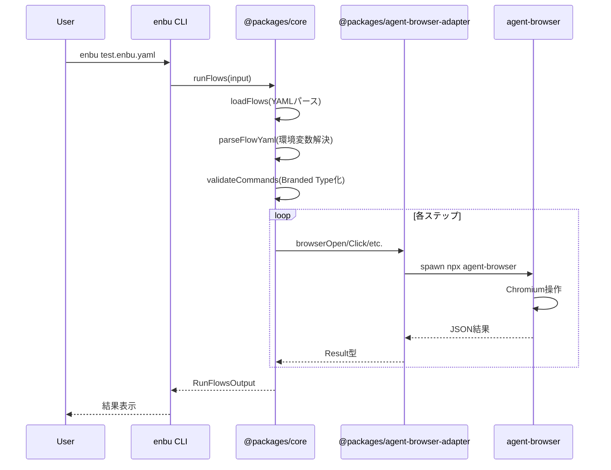
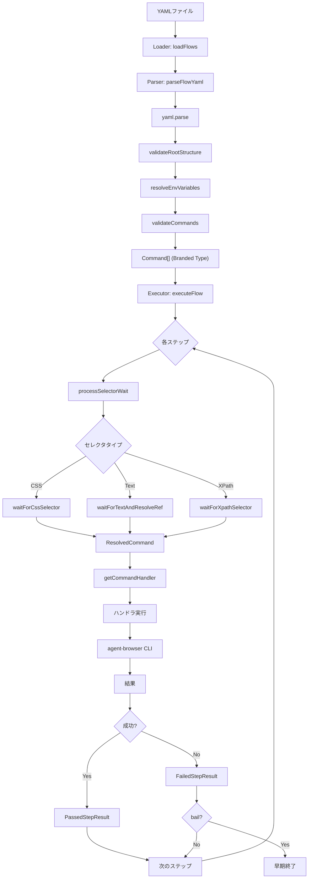

# Codebase Map

> Auto-generated by Cartographer. Last mapped: 2026-01-21

## System Overview

enbu（演武）は、YAMLベースのブラウザE2Eテストフレームワークです。agent-browser（Vercel Labs製Rust CLI）をラップし、人間が読みやすいYAML形式でテストフローを記述できます。



### 処理フロー



## Directory Structure

```
/workspaces/agent-browser-flow/
├── apps/                           # アプリケーション層
│   ├── cli/                        # enbu CLI (npm公開)
│   │   ├── src/
│   │   │   ├── main.ts            # エントリーポイント
│   │   │   ├── args-parser.ts     # 引数パーサー
│   │   │   ├── types.ts           # CLI型定義
│   │   │   ├── commands/          # コマンド実装
│   │   │   │   ├── run.ts         # フロー実行
│   │   │   │   ├── init.ts        # 初期化
│   │   │   │   └── cleanup.ts     # セッションクリーンアップ
│   │   │   ├── output/            # 出力フォーマッター
│   │   │   └── utils/             # ユーティリティ
│   │   └── package.json
│   │
│   ├── vscode-extension/           # VS Code拡張
│   │   ├── src/
│   │   │   ├── extension.ts       # 拡張エントリー
│   │   │   ├── testController.ts  # Test Explorer統合
│   │   │   ├── flowRunner.ts      # CLI呼び出し
│   │   │   └── stepHighlighter.ts # ステップハイライト
│   │   └── package.json
│   │
│   └── schema/                     # JSON Schema生成
│
├── packages/                       # ライブラリ層
│   ├── core/                       # コアライブラリ
│   │   ├── src/
│   │   │   ├── index.ts           # 公開API
│   │   │   ├── orchestrator/      # パイプライン統合
│   │   │   │   ├── run-flows.ts   # メインエントリー
│   │   │   │   └── types.ts       # Orchestrator型
│   │   │   ├── executor/          # コマンド実行
│   │   │   │   ├── flow-executor.ts
│   │   │   │   ├── execute-step.ts
│   │   │   │   ├── selector-wait.ts
│   │   │   │   └── commands/      # コマンドハンドラ
│   │   │   ├── parser/            # YAML解析
│   │   │   │   ├── yaml-parser.ts
│   │   │   │   ├── env-resolver.ts
│   │   │   │   ├── schemas/       # Valibotスキーマ
│   │   │   │   └── validators/    # コマンド検証
│   │   │   ├── loader/            # ファイル読み込み
│   │   │   ├── types/             # 型定義
│   │   │   └── generator/         # ドキュメント生成
│   │   ├── docs/                   # 自動生成ドキュメント
│   │   └── schemas/                # JSON Schema
│   │
│   ├── agent-browser-adapter/      # CLIアダプター
│   │   ├── src/
│   │   │   ├── index.ts           # 公開API
│   │   │   ├── executor.ts        # CLI実行
│   │   │   ├── validator.ts       # 出力検証
│   │   │   ├── types.ts           # Brand型定義
│   │   │   ├── schemas.ts         # データスキーマ
│   │   │   └── commands/          # コマンド関数
│   │   │       ├── navigation.ts  # open
│   │   │       ├── interaction.ts # click, type, fill
│   │   │       ├── scroll.ts      # scroll, scrollIntoView
│   │   │       ├── wait.ts        # wait系
│   │   │       ├── capture.ts     # screenshot, snapshot
│   │   │       ├── is.ts          # isVisible等
│   │   │       └── session.ts     # close
│   │   └── package.json
│   │
│   ├── config/                     # 共通tsconfig
│   └── pnpm-sync/                  # 依存同期
│
├── example/                        # サンプルプロジェクト
│   ├── simple/                     # 基本操作 (ポート3000)
│   ├── navigation/                 # ナビゲーション (ポート3010)
│   ├── form-input/                 # フォーム入力 (ポート3020)
│   ├── scroll/                     # スクロール (ポート3030)
│   ├── utility/                    # wait, screenshot等 (ポート3040)
│   ├── assertions/                 # アサーション (ポート3050)
│   └── ec/                         # ECサイト総合 (ポート3060)
│
├── tests/                          # テスト
│   ├── e2e/                        # E2Eテスト
│   ├── integration/                # 統合テスト
│   ├── fixtures/                   # テストフィクスチャ
│   └── utils/                      # テストユーティリティ
│
├── docs/                           # ドキュメント
│   ├── ARCHITECTURE.md
│   ├── development/
│   └── issues/
│
└── 設定ファイル群
    ├── package.json               # ルートパッケージ
    ├── pnpm-workspace.yaml        # ワークスペース定義
    ├── nx.json                    # Nx設定
    ├── tsconfig.json              # TypeScript設定
    ├── eslint.config.mjs          # ESLint設定
    ├── biome.json                 # フォーマッター
    └── vitest.*.config.ts         # テスト設定
```

## Module Guide

### packages/core

**目的**: YAMLフロー定義の読み込み・解析・検証・実行を担当するコアライブラリ

**エントリーポイント**: `packages/core/src/index.ts`

**主要エクスポート**:
- `runFlows`: フロー実行のメインAPI
- `getStepLineNumbers`: YAMLステップの行番号取得（VS Code拡張用）

**レイヤー構成**:
| レイヤー | 責務 | 入力 | 出力 |
|---------|------|------|------|
| Loader | ファイル読み込み | filePath | yamlContent |
| Parser | YAML解析・検証 | yaml | Command[] (Branded) |
| Executor | コマンド実行 | Command | StepResult |
| Orchestrator | パイプライン統合 | RunFlowsInput | RunFlowsOutput |

**主要ファイル**:
| ファイル | 目的 | トークン数 |
|---------|------|-----------|
| `src/orchestrator/run-flows.ts` | パイプライン統合 | ~2000 |
| `src/executor/flow-executor.ts` | フロー実行エンジン | ~1500 |
| `src/executor/execute-step.ts` | ステップ実行 | ~2500 |
| `src/parser/yaml-parser.ts` | YAML解析 | ~2000 |
| `src/parser/env-resolver.ts` | 環境変数解決 | ~1000 |
| `src/types/commands.ts` | コマンド型定義 | ~2500 |

**デザインパターン**:
- **Result型パターン**: neverthrowによる型安全なエラーハンドリング
- **Branded Types**: Valibotによる段階的検証
- **Single Source of Truth**: スキーマから型・ドキュメント生成
- **Pipeline処理**: Result.andThenによる処理連鎖

---

### packages/agent-browser-adapter

**目的**: agent-browser CLIをTypeScriptから型安全に呼び出すアダプター

**エントリーポイント**: `packages/agent-browser-adapter/src/index.ts`

**主要エクスポート**:
- コマンド関数: `browserOpen`, `browserClick`, `browserFill`, etc. (25+関数)
- Brand型: `CssSelector`, `RefSelector`, `TextSelector`, `Url`, etc.
- ファクトリ: `asCssSelector`, `asUrl`, etc.
- ユーティリティ: `checkAgentBrowser`

**主要ファイル**:
| ファイル | 目的 | トークン数 |
|---------|------|-----------|
| `src/executor.ts` | CLI実行コア | ~800 |
| `src/validator.ts` | JSON出力検証 | ~400 |
| `src/types.ts` | Brand型定義 | ~1500 |
| `src/commands/interaction.ts` | click, type, fill等 | ~600 |
| `src/commands/wait.ts` | wait系7関数 | ~500 |

**デザインパターン**:
- **Adapter Pattern**: 外部CLIとの境界管理
- **Brand Pattern**: 型安全な文字列処理
- **Schema-Driven Validation**: 外部出力の厳密検証

---

### apps/cli

**目的**: enbu CLIアプリケーション（npm公開パッケージ）

**エントリーポイント**: `apps/cli/src/main.ts`

**コマンド**:
- `enbu [files...]`: フロー実行（デフォルト）
- `enbu init`: プロジェクト初期化
- `enbu cleanup`: セッションクリーンアップ

**主要オプション**:
| オプション | 説明 |
|-----------|------|
| `--headed` | ヘッド付きブラウザ起動 |
| `--env KEY=VALUE` | 環境変数設定（複数可） |
| `--timeout <ms>` | タイムアウト設定 |
| `--screenshot` | スクリーンショット撮影 |
| `--session <name>` | セッション名指定 |
| `--parallel <N>` | 並列実行数 |
| `--progress-json` | JSON進捗出力 |

**終了コード**:
- `0`: 成功
- `1`: フロー実行失敗（テスト失敗）
- `2`: 実行エラー（agent-browser未インストール等）

---

### apps/vscode-extension

**目的**: VS Code Test Explorerでenbuフローを実行・視覚化

**エントリーポイント**: `apps/vscode-extension/src/extension.ts`

**主要機能**:
- `.enbu.yaml`ファイルの自動検出
- Test Explorerへのテスト表示
- 実行中ステップのハイライト表示
- テスト結果の可視化

**主要ファイル**:
| ファイル | 目的 |
|---------|------|
| `src/testController.ts` | Test API統合 |
| `src/flowRunner.ts` | CLI呼び出し・進捗解析 |
| `src/stepHighlighter.ts` | エディタデコレーション |

---

## Data Flow

### YAMLフロー実行の詳細フロー



### 型の変換フロー

```
YAML文字列
  ↓ yaml.parse()
unknown
  ↓ validateRootStructure()
Record<string, unknown>
  ↓ resolveEnvVariables()
RawFlowData (環境変数解決済み)
  ↓ validateCommands()
Command[] (Branded Type)
  ↓ processSelectorWait()
ResolvedCommand (セレクタ解決済み)
  ↓ ハンドラ実行
StepResult
```

## Conventions

### コーディング規約

1. **エラーハンドリング**: `throw`禁止、neverthrowのResult型を使用
2. **型アサーション**: `as`禁止、型注釈を使用
3. **オプショナル**: `?:`禁止、`NoInput`/`UseDefault`型を使用（ドメイン層）
4. **パターンマッチ**: `in`演算子禁止、ts-patternを使用
5. **console禁止**: ロガーを使用

### ファイル命名規約

- コンポーネント: PascalCase (`StepHighlighter.ts`)
- 関数/ユーティリティ: kebab-case (`yaml-parser.ts`)
- テスト: `*.test.ts`
- E2Eテスト: `*.e2e.test.ts`

### コマンドスキーマの追加

1. `packages/core/src/parser/schemas/commands/`に新スキーマ追加
2. `command-registry.ts`にエントリ追加
3. `pnpm run generate-docs`でドキュメント自動生成

## Gotchas

### Parser層
1. **環境変数解決のタイミング**: Command型検証前に実行される
2. **新形式のみサポート**: `steps:`キー必須、配列ルート非対応
3. **fromThrowableのスコープ**: 外部ライブラリのみを含む（最小化）

### Executor層
4. **セレクタ待機対象外**: `assertVisible`, `assertNotVisible`, `scrollIntoView`
5. **textセレクタの変換**: RefSelectorに変換（複数マッチはエラー）
6. **セッション名の長さ**: Unixドメインソケット制限対策で短く生成

### Adapter層
7. **exitCode 0でも失敗**: agent-browserは`success: false`を返す場合あり
8. **shell: true**: Windows互換性のため使用、escapeShellArgで保護

### VS Code拡張
9. **ファイル単位実行のみ**: ステップは表示のみ、実行は親ファイル全体
10. **成功時のみセッションクローズ**: 失敗時はデバッグ用に残す

## Navigation Guide

### 新しいコマンドを追加するには
1. `packages/core/src/parser/schemas/commands/`にスキーマ追加
2. `packages/core/src/parser/schemas/command-registry.ts`に登録
3. `packages/core/src/types/commands.ts`に型追加
4. `packages/core/src/executor/commands/handler-registry.ts`にハンドラ追加
5. `packages/core/src/executor/commands/`にハンドラ実装
6. `packages/agent-browser-adapter/src/commands/`にCLI呼び出し追加

### テストを追加するには
1. ユニットテスト: 対象ファイルと同じディレクトリに`*.test.ts`
2. 統合テスト: `tests/integration/`
3. E2Eテスト: `tests/e2e/`
4. サンプル: `example/`配下に専用ディレクトリ

### VS Code拡張を修正するには
1. `apps/vscode-extension/src/extension.ts`: アクティベーション
2. `apps/vscode-extension/src/testController.ts`: Test Explorer統合
3. `apps/vscode-extension/src/flowRunner.ts`: CLI呼び出し
4. `apps/vscode-extension/src/stepHighlighter.ts`: ハイライト表示

### リリースするには
```bash
# バージョン更新 + CHANGELOG生成 + タグ作成
pnpm exec nx release --version=patch  # or minor, major

# GitHubにプッシュ（GitHub Actionsが自動でnpm公開）
git push && git push --tags
```

## Tech Stack

| 技術 | 用途 |
|------|------|
| TypeScript 5.9 | 言語 |
| Nx 22 | ビルドシステム |
| pnpm 10 | パッケージマネージャー |
| Vitest | テストランナー |
| Valibot | スキーマ検証 |
| neverthrow | Result型 |
| ts-pattern | パターンマッチ |
| agent-browser | ブラウザ自動化 |
| Biome | フォーマッター |
| ESLint + oxlint | Linter |

## Commands Reference

| コマンド | 説明 | 例 |
|---------|------|-----|
| `open` | URLを開く | `open: https://example.com` |
| `click` | クリック | `click: ログイン` |
| `type` | テキスト追記 | `type: { text: 名前, value: 太郎 }` |
| `fill` | クリア+入力 | `fill: { css: "#email", value: test@example.com }` |
| `press` | キー操作 | `press: Enter` |
| `hover` | ホバー | `hover: メニュー` |
| `select` | セレクト | `select: { text: 国, value: 日本 }` |
| `scroll` | スクロール | `scroll: { direction: down, amount: 500 }` |
| `scrollIntoView` | 要素までスクロール | `scrollIntoView: フッター` |
| `wait` | 待機 | `wait: 2000` or `wait: { text: 完了 }` |
| `screenshot` | 撮影 | `screenshot: { path: ./ss.png, full: true }` |
| `eval` | JS実行 | `eval: "document.title"` |
| `assertVisible` | 表示確認 | `assertVisible: Welcome` |
| `assertNotVisible` | 非表示確認 | `assertNotVisible: エラー` |
| `assertEnabled` | 有効確認 | `assertEnabled: 送信` |
| `assertChecked` | チェック確認 | `assertChecked: { text: 同意, checked: true }` |
