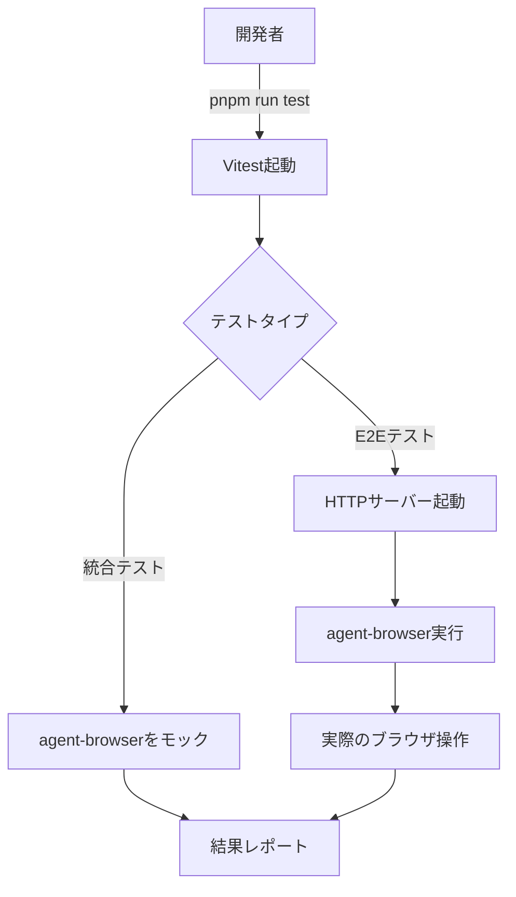
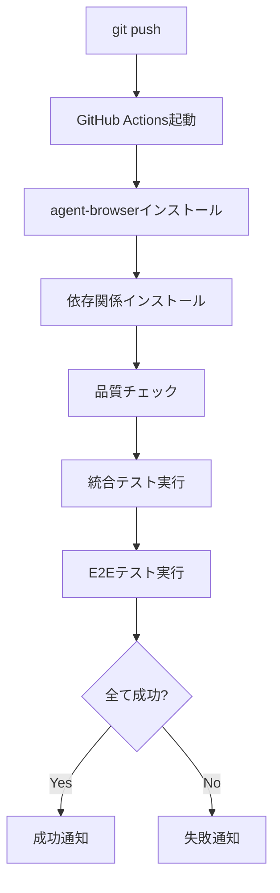

# Phase 5: テスト計画

このドキュメントは統合テストとE2Eテストの詳細なテスト計画を定義します。

---

## テスト戦略

### テストピラミッド

```
           E2E (遅い、少ない)
          /                \
    統合テスト (中程度)
   /                        \
ユニットテスト (速い、多い)
```

Phase 5 では、ピラミッドの上位2層を実装します:

- **統合テスト**: モジュール間の連携を検証（agent-browserはモック化）
- **E2Eテスト**: 実際のブラウザ操作を検証（完全な環境）

### テスト実行環境

| 環境 | 統合テスト | E2Eテスト | agent-browser |
|------|-----------|-----------|---------------|
| ローカル開発 | 常時実行 | 必要に応じて実行 | ユーザーがインストール |
| CI/CD | 常時実行 | 常時実行 | 自動インストール |

---

## 統合テスト（Integration Tests）

### 対象範囲

```
┌─────────┐
│   CLI   │ ← テスト対象
└────┬────┘
     │
┌────▼────┐
│  core   │ ← テスト対象
└────┬────┘
     │
┌────▼────┐
│ adapter │ ← モック化
└─────────┘
     │
     ▼
agent-browser (モック)
```

### テストファイル構成

#### tests/integration/cli.test.ts

CLIの基本機能を検証します。

**テストケース一覧**:

| ID | テストケース | 前提条件 | 検証項目 |
|----|-------------|---------|---------|
| I-CLI-1 | ヘルプ表示 | - | `--help` で使用方法が表示される |
| I-CLI-2 | バージョン表示 | - | `--version` でバージョンが表示される |
| I-CLI-3 | フローファイル実行 | simple.enbu.yaml | 正常に実行され、exitCode 0 |
| I-CLI-4 | 存在しないフローファイル | - | エラーメッセージが表示され、exitCode 1 |
| I-CLI-5 | セッション指定 | simple.enbu.yaml | `--session` オプションが正しく渡される |
| I-CLI-6 | ヘッドレスモード指定 | simple.enbu.yaml | `--headed` オプションが正しく渡される |
| I-CLI-7 | スクリーンショット出力 | simple.enbu.yaml | `--screenshot-dir` で画像が保存される |

**実装例**:

```typescript
import { describe, it, expect, vi, beforeEach } from 'vitest';
import { spawn } from 'node:child_process';
import { readFile, access } from 'node:fs/promises';

describe('CLI Integration Tests', () => {
  beforeEach(() => {
    // agent-browserをモック化
    vi.mock('@packages/agent-browser-adapter', () => ({
      checkAgentBrowser: vi.fn().mockResolvedValue({ isOk: () => true }),
      executeCommand: vi.fn().mockResolvedValue({
        isOk: () => true,
        value: '{"success":true,"data":{},"error":null}',
      }),
    }));
  });

  /**
   * I-CLI-1: ヘルプ表示
   *
   * 前提条件: なし
   * 検証項目: --help で使用方法が表示される
   */
  it('I-CLI-1: --help で使用方法が表示される', async () => {
    // Arrange & Act
    const result = await runCli(['--help']);

    // Assert
    expect(result.exitCode).toBe(0);
    expect(result.stdout).toContain('Usage:');
    expect(result.stdout).toContain('enbu');
  });

  /**
   * I-CLI-2: バージョン表示
   *
   * 前提条件: なし
   * 検証項目: --version でバージョンが表示される
   */
  it('I-CLI-2: --version でバージョンが表示される', async () => {
    // Arrange & Act
    const result = await runCli(['--version']);

    // Assert
    expect(result.exitCode).toBe(0);
    expect(result.stdout).toMatch(/\d+\.\d+\.\d+/);
  });

  /**
   * I-CLI-3: フローファイル実行
   *
   * 前提条件: tests/fixtures/flows/simple.enbu.yaml が存在
   * 検証項目: 正常に実行され、exitCode 0
   */
  it('I-CLI-3: フローファイルを正常に実行できる', async () => {
    // Arrange
    const flowPath = 'tests/fixtures/flows/simple.enbu.yaml';

    // Act
    const result = await runCli([flowPath]);

    // Assert
    expect(result.exitCode).toBe(0);
    expect(result.stdout).toContain('Flow execution completed');
  });

  /**
   * I-CLI-4: 存在しないフローファイル
   *
   * 前提条件: なし
   * 検証項目: エラーメッセージが表示され、exitCode 1
   */
  it('I-CLI-4: 存在しないフローファイルでエラーを返す', async () => {
    // Arrange & Act
    const result = await runCli(['not-exist.enbu.yaml']);

    // Assert
    expect(result.exitCode).toBe(1);
    expect(result.stderr).toContain('File not found');
  });

  /**
   * I-CLI-5: セッション指定
   *
   * 前提条件: tests/fixtures/flows/simple.enbu.yaml が存在
   * 検証項目: --session オプションが正しく渡される
   */
  it('I-CLI-5: --session オプションが正しく渡される', async () => {
    // Arrange
    const flowPath = 'tests/fixtures/flows/simple.enbu.yaml';
    const sessionName = 'test-session-123';

    // Act
    const result = await runCli([flowPath, '--session', sessionName]);

    // Assert
    expect(result.exitCode).toBe(0);
    // adapter.executeCommand が正しい sessionName で呼ばれたか確認
    expect(vi.mocked(executeCommand)).toHaveBeenCalledWith(
      expect.any(String),
      expect.any(Array),
      expect.objectContaining({ sessionName })
    );
  });

  /**
   * I-CLI-6: ヘッドレスモード指定
   *
   * 前提条件: tests/fixtures/flows/simple.enbu.yaml が存在
   * 検証項目: --headed オプションが正しく渡される
   */
  it('I-CLI-6: --headed オプションが正しく渡される', async () => {
    // Arrange
    const flowPath = 'tests/fixtures/flows/simple.enbu.yaml';

    // Act
    const result = await runCli([flowPath, '--headed']);

    // Assert
    expect(result.exitCode).toBe(0);
    // adapter.executeCommand が headed: true で呼ばれたか確認
    expect(vi.mocked(executeCommand)).toHaveBeenCalledWith(
      expect.any(String),
      expect.any(Array),
      expect.objectContaining({ headed: true })
    );
  });

  /**
   * I-CLI-7: スクリーンショット出力
   *
   * 前提条件: tests/fixtures/flows/simple.enbu.yaml が存在
   * 検証項目: --screenshot-dir で画像が保存される
   */
  it('I-CLI-7: スクリーンショットが指定ディレクトリに保存される', async () => {
    // Arrange
    const flowPath = 'tests/fixtures/flows/simple.enbu.yaml';
    const screenshotDir = '/tmp/test-screenshots';

    // Act
    const result = await runCli([flowPath, '--screenshot-dir', screenshotDir]);

    // Assert
    expect(result.exitCode).toBe(0);
    // スクリーンショットファイルが存在するか確認
    await expect(access(`${screenshotDir}/screenshot-1.png`)).resolves.not.toThrow();
  });
});

/**
 * CLIを実行するヘルパー関数
 */
const runCli = async (args: string[]): Promise<{ exitCode: number; stdout: string; stderr: string }> => {
  return new Promise((resolve) => {
    const proc = spawn('node', ['apps/cli/src/index.ts', ...args], {
      stdio: ['ignore', 'pipe', 'pipe'],
    });

    let stdout = '';
    let stderr = '';

    proc.stdout.on('data', (data) => { stdout += data.toString(); });
    proc.stderr.on('data', (data) => { stderr += data.toString(); });

    proc.on('close', (exitCode) => {
      resolve({ exitCode: exitCode ?? 1, stdout, stderr });
    });
  });
};
```

#### tests/integration/error-handling.test.ts

エラーハンドリングの統合を検証します。

**テストケース一覧**:

| ID | テストケース | 前提条件 | 検証項目 |
|----|-------------|---------|---------|
| I-ERR-1 | agent-browser未インストール | agent-browser なし | 適切なエラーメッセージとインストール案内 |
| I-ERR-2 | YAMLパースエラー | 不正なYAMLファイル | 構文エラーの行番号と内容を表示 |
| I-ERR-3 | 不明なアクション | unknown-action.enbu.yaml | サポートされていないアクションのエラー |
| I-ERR-4 | タイムアウト | timeout.enbu.yaml | タイムアウトエラーと再試行の案内 |
| I-ERR-5 | アサーション失敗 | assertion-fail.enbu.yaml | 期待値と実際の値を表示 |

**実装例**:

```typescript
import { describe, it, expect, vi, beforeEach } from 'vitest';
import { err } from 'neverthrow';

describe('Error Handling Integration Tests', () => {
  /**
   * I-ERR-1: agent-browser未インストール
   *
   * 前提条件: checkAgentBrowser が not_installed エラーを返す
   * 検証項目: 適切なエラーメッセージとインストール案内
   */
  it('I-ERR-1: agent-browser未インストール時に適切なエラーメッセージを表示', async () => {
    // Arrange
    vi.mocked(checkAgentBrowser).mockResolvedValue(
      err({ type: 'not_installed', message: 'agent-browser is not installed' })
    );

    // Act
    const result = await runCli(['tests/fixtures/flows/simple.enbu.yaml']);

    // Assert
    expect(result.exitCode).toBe(1);
    expect(result.stderr).toContain('agent-browser is not installed');
    expect(result.stderr).toContain('cargo install agent-browser');
  });

  /**
   * I-ERR-2: YAMLパースエラー
   *
   * 前提条件: tests/fixtures/flows/invalid.enbu.yaml が構文エラーを含む
   * 検証項目: 構文エラーの行番号と内容を表示
   */
  it('I-ERR-2: YAML構文エラーで行番号を表示', async () => {
    // Arrange & Act
    const result = await runCli(['tests/fixtures/flows/invalid.enbu.yaml']);

    // Assert
    expect(result.exitCode).toBe(1);
    expect(result.stderr).toContain('Parse error');
    expect(result.stderr).toMatch(/line \d+/i);
  });

  /**
   * I-ERR-3: 不明なアクション
   *
   * 前提条件: tests/fixtures/flows/unknown-action.enbu.yaml が存在
   * 検証項目: サポートされていないアクションのエラー
   */
  it('I-ERR-3: 不明なアクションで適切なエラーを表示', async () => {
    // Arrange & Act
    const result = await runCli(['tests/fixtures/flows/unknown-action.enbu.yaml']);

    // Assert
    expect(result.exitCode).toBe(1);
    expect(result.stderr).toContain('Unknown action');
    expect(result.stderr).toContain('Supported actions:');
  });

  /**
   * I-ERR-4: タイムアウト
   *
   * 前提条件: executeCommand が timeout エラーを返す
   * 検証項目: タイムアウトエラーと再試行の案内
   */
  it('I-ERR-4: タイムアウト時に再試行の案内を表示', async () => {
    // Arrange
    vi.mocked(executeCommand).mockResolvedValue(
      err({
        type: 'timeout',
        command: 'open',
        args: ['https://slow.example.com'],
        timeoutMs: 30000,
      })
    );

    // Act
    const result = await runCli(['tests/fixtures/flows/simple.enbu.yaml']);

    // Assert
    expect(result.exitCode).toBe(1);
    expect(result.stderr).toContain('Timeout');
    expect(result.stderr).toContain('30000');
    expect(result.stderr).toContain('--timeout');
  });

  /**
   * I-ERR-5: アサーション失敗
   *
   * 前提条件: tests/fixtures/flows/assertion-fail.enbu.yaml が存在
   * 検証項目: 期待値と実際の値を表示
   */
  it('I-ERR-5: アサーション失敗時に期待値と実際の値を表示', async () => {
    // Arrange
    vi.mocked(executeCommand).mockResolvedValue(
      err({
        type: 'command_failed',
        command: 'click',
        args: ['ログインボタン', '--json'],
        exitCode: 1,
        stderr: '',
        errorMessage: 'Element not found: ログインボタン',
      })
    );

    // Act
    const result = await runCli(['tests/fixtures/flows/assertion-fail.enbu.yaml']);

    // Assert
    expect(result.exitCode).toBe(1);
    expect(result.stderr).toContain('Element not found');
    expect(result.stderr).toContain('ログインボタン');
  });
});
```

---

## E2Eテスト（End-to-End Tests）

### 対象範囲

```
┌─────────┐
│   CLI   │ ← テスト対象
└────┬────┘
     │
┌────▼────┐
│  core   │ ← テスト対象
└────┬────┘
     │
┌────▼────┐
│ adapter │ ← テスト対象
└─────────┘
     │
     ▼
agent-browser (実際のCLI)
     │
     ▼
Browser (実際のブラウザ)
```

### テスト環境のセットアップ

E2Eテストでは、HTMLフィクスチャを配信するHTTPサーバーが必要です。

```typescript
// tests/utils/file-server.ts
import { createServer } from 'node:http';
import { readFile } from 'node:fs/promises';
import { join } from 'node:path';

/**
 * テスト用HTTPサーバーを起動する
 *
 * @param port - リスンするポート番号
 * @returns サーバーのURLとclose関数
 */
export const startTestServer = async (
  port: number
): Promise<{ url: string; close: () => Promise<void> }> => {
  const fixturesDir = join(__dirname, '../fixtures/html');

  const server = createServer(async (req, res) => {
    const filename = req.url?.slice(1) || 'index.html';
    const filePath = join(fixturesDir, filename);

    try {
      const content = await readFile(filePath, 'utf-8');
      res.writeHead(200, { 'Content-Type': 'text/html' });
      res.end(content);
    } catch (error) {
      res.writeHead(404);
      res.end('Not Found');
    }
  });

  await new Promise<void>((resolve) => {
    server.listen(port, resolve);
  });

  return {
    url: `http://localhost:${port}`,
    close: async () => {
      await new Promise<void>((resolve, reject) => {
        server.close((err) => {
          if (err) reject(err);
          else resolve();
        });
      });
    },
  };
};
```

### テストファイル構成

#### tests/e2e/basic-flow.test.ts

基本的なナビゲーションとアサーションを検証します。

**テストケース一覧**:

| ID | テストケース | フローファイル | 検証項目 |
|----|-------------|---------------|---------|
| E-BASIC-1 | ページを開く | simple.enbu.yaml | open コマンドが成功 |
| E-BASIC-2 | 要素の存在確認 | simple.enbu.yaml | assertVisible でh1が見つかる |
| E-BASIC-3 | 複数ステップの実行 | simple.enbu.yaml | 全ステップが順次実行される |
| E-BASIC-4 | スクリーンショット | simple.enbu.yaml | 画像ファイルが生成される |

**実装例**:

```typescript
import { describe, it, expect, beforeAll, afterAll } from 'vitest';
import { startTestServer } from '../utils/file-server';
import { runCli } from '../utils/test-helpers';
import { access } from 'node:fs/promises';

describe('E2E: Basic Flow Tests', () => {
  let server: Awaited<ReturnType<typeof startTestServer>>;

  beforeAll(async () => {
    // テスト用HTTPサーバーを起動
    server = await startTestServer(8080);
  });

  afterAll(async () => {
    // サーバーを停止
    await server.close();
  });

  /**
   * E-BASIC-1: ページを開く
   *
   * 前提条件: tests/fixtures/flows/simple.enbu.yaml が存在
   * 検証項目: open コマンドが成功
   */
  it('E-BASIC-1: ページを正常に開ける', async () => {
    // Arrange & Act
    const result = await runCli(['tests/fixtures/flows/simple.enbu.yaml']);

    // Assert
    expect(result.exitCode).toBe(0);
    expect(result.stdout).toContain('Flow execution completed');
  }, 30000); // タイムアウト: 30秒

  /**
   * E-BASIC-2: 要素の存在確認
   *
   * 前提条件: tests/fixtures/html/login-form.html にh1要素が存在
   * 検証項目: assertVisible でh1が見つかる
   */
  it('E-BASIC-2: 要素の存在を確認できる', async () => {
    // Arrange & Act
    const result = await runCli(['tests/fixtures/flows/simple.enbu.yaml']);

    // Assert
    expect(result.exitCode).toBe(0);
    // ログに「ログイン」要素が見つかったことが記録される
    expect(result.stdout).toContain('assertVisible: ログイン');
  }, 30000);

  /**
   * E-BASIC-3: 複数ステップの実行
   *
   * 前提条件: tests/fixtures/flows/simple.enbu.yaml が3ステップを含む
   * 検証項目: 全ステップが順次実行される
   */
  it('E-BASIC-3: 複数ステップを順次実行できる', async () => {
    // Arrange & Act
    const result = await runCli(['tests/fixtures/flows/simple.enbu.yaml']);

    // Assert
    expect(result.exitCode).toBe(0);
    // 各ステップのログが順序通り出力される
    expect(result.stdout).toMatch(/Step 1.*Step 2.*Step 3/s);
  }, 30000);

  /**
   * E-BASIC-4: スクリーンショット
   *
   * 前提条件: tests/fixtures/flows/simple.enbu.yaml が screenshot を含む
   * 検証項目: 画像ファイルが生成される
   */
  it('E-BASIC-4: スクリーンショットが生成される', async () => {
    // Arrange
    const screenshotDir = '/tmp/e2e-screenshots';

    // Act
    const result = await runCli([
      'tests/fixtures/flows/simple.enbu.yaml',
      '--screenshot-dir',
      screenshotDir,
    ]);

    // Assert
    expect(result.exitCode).toBe(0);
    // スクリーンショットファイルが存在する
    await expect(access(`${screenshotDir}/screenshot-1.png`)).resolves.not.toThrow();
  }, 30000);
});
```

#### tests/e2e/assertions.test.ts

各種アサーションを検証します。

**テストケース一覧**:

| ID | テストケース | フローファイル | 検証項目 |
|----|-------------|---------------|---------|
| E-ASSERT-1 | assertVisible | assertions.enbu.yaml | 可視要素が検出される |
| E-ASSERT-2 | assertEnabled | assertions.enbu.yaml | 有効なボタンが検出される |
| E-ASSERT-3 | assertDisabled | assertions.enbu.yaml | 無効なボタンが検出される |
| E-ASSERT-4 | assertChecked | assertions.enbu.yaml | チェック済みのチェックボックス |
| E-ASSERT-5 | assertUnchecked | assertions.enbu.yaml | 未チェックのチェックボックス |

#### tests/e2e/interactions.test.ts

入力・クリック操作を検証します。

**テストケース一覧**:

| ID | テストケース | フローファイル | 検証項目 |
|----|-------------|---------------|---------|
| E-INT-1 | type | interactions.enbu.yaml | テキスト入力が成功 |
| E-INT-2 | fill | interactions.enbu.yaml | フォーム入力が成功 |
| E-INT-3 | click | interactions.enbu.yaml | ボタンクリックが成功 |
| E-INT-4 | press | interactions.enbu.yaml | キーボード操作が成功 |
| E-INT-5 | 複数要素の操作 | interactions.enbu.yaml | 連続した操作が全て成功 |

#### tests/e2e/error-cases.test.ts

エラーケースを検証します。

**テストケース一覧**:

| ID | テストケース | フローファイル | 検証項目 |
|----|-------------|---------------|---------|
| E-ERR-1 | 存在しない要素 | error-case.enbu.yaml | 適切なエラーメッセージ |
| E-ERR-2 | 無効な操作 | error-case.enbu.yaml | 無効な操作のエラー |
| E-ERR-3 | タイムアウト | error-case.enbu.yaml | タイムアウトエラー |
| E-ERR-4 | アサーション失敗 | error-case.enbu.yaml | 期待値との差分表示 |

---

## テスト実行フロー

### ローカル開発環境



### CI/CD環境（GitHub Actions）



---

## パフォーマンス目標

| テストタイプ | 目標実行時間 | 最大実行時間 |
|-------------|-------------|-------------|
| 統合テスト全体 | 30秒 | 1分 |
| E2Eテスト全体 | 3分 | 5分 |
| CI全体（品質チェック含む） | 8分 | 10分 |

---

## テストデータ管理

### フィクスチャファイルの命名規則

- **HTMLファイル**: `{用途}.html`（例: `login-form.html`）
- **フローファイル**: `{シナリオ}.enbu.yaml`（例: `simple.enbu.yaml`）

### フィクスチャの保守

- 新しいテストケースを追加する際は、既存のフィクスチャを再利用
- 再利用できない場合のみ、新しいフィクスチャを作成
- フィクスチャ仕様は [FIXTURES.md](./FIXTURES.md) に記載

---

## 受け入れ基準チェックリスト

Phase 5 完了時に以下を全て満たすこと:

### 統合テスト

- [ ] **I-CLI-1～7**: 全てのCLI統合テストがパス
- [ ] **I-ERR-1～5**: 全てのエラーハンドリングテストがパス

### E2Eテスト

- [ ] **E-BASIC-1～4**: 全ての基本フローテストがパス
- [ ] **E-ASSERT-1～5**: 全てのアサーションテストがパス
- [ ] **E-INT-1～5**: 全ての操作テストがパス
- [ ] **E-ERR-1～4**: 全てのエラーケーステストがパス

### CI/CD

- [ ] GitHub Actionsで全テストが成功
- [ ] CI実行時間が10分以内
- [ ] 失敗時に適切なログが出力される

### パフォーマンス

- [ ] 統合テストが1分以内に完了
- [ ] E2Eテストが5分以内に完了

### ドキュメント

- [ ] README.md のサンプルが全て実行可能
- [ ] TEST_PLAN.md に全テストケースが記載
- [ ] FIXTURES.md に全フィクスチャが記載
- [ ] CI.md にCI設定の詳細が記載
